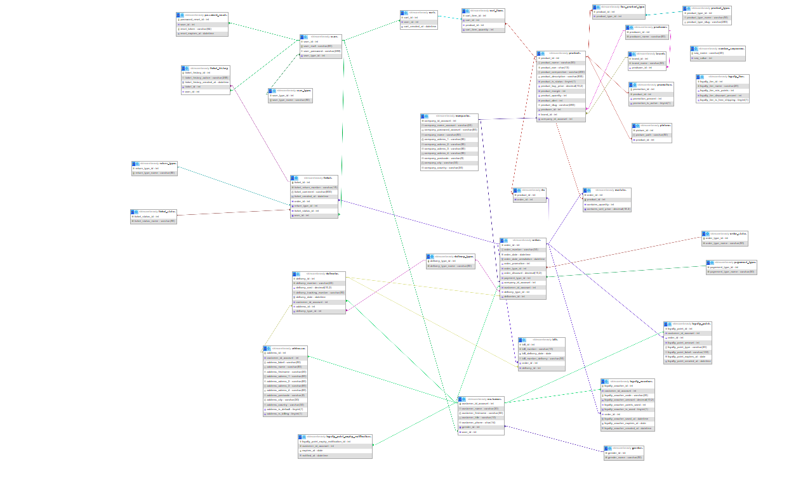

# Documentation Technique — Skin Care Beauty

**Auteurs :** Camil Bernardeau & Mathieu Chapart
**Dernière mise à jour :** 05/08/2026

---

## Historique des évolutions

| Version | Date       | Nature de l'évolution         |
| ------- | ---------- | ----------------------------- |
| 1.0.0   | 05/06/2026 | Création de la BDD SQL        |
| 1.0.1   | 09/06/2026 | Correction du script initial, insertion des données de test, conventions d'équipe |
| 1.1.0   | 11/06/2026 | MCD réalisé sous Looping, documentation technique de la BDD |
| 1.2.0   | 30/06/2026 | Intégration front (accueil, produit, profil, inscription/connexion) + espace admin + `db.php` (PDO), protections XSS |
| 1.3.0   | 23/07/2026 | Architecture MVC (Router, contrôleurs, vues — home, catégories, produit) + panier en session avec AJAX |
| 1.4.0   | 28/07/2026 | Checkout, pages admin connectées à la BDD (commandes, clients), premiers tests unitaires (`ProductDAOTest`) + CI GitHub Actions PHPUnit |
| 1.5.0   | 31/07/2026 | Upload d'images produits, suppression des JOIN restants (résolution PHP), dockerisation (app, db, phpMyAdmin) |
| 2.0.0   | 04/08/2026 | Module SAV : tables tickets/historique, POO `Ticket`/`TicketHistory` + DAO, workflow de retour, PHPMailer + conteneur Mailpit, tests unitaires `TicketDAOTest` |
| 2.1.0   | 04/08/2026 | Module Fidélité : tables points/paliers/bons, `LoyaltyService`, abstraction `MailerInterface` / `PhpMailerService`, tests `LoyaltyServiceTest` |
| 2.2.0   | 05/08/2026 | Droits et rôles : type « Agent SAV », espace admin cloisonné (`auth.php`), demande de retour côté client, workflow validation/refus, correction d'historique réservée à l'administrateur, tests `TicketHistoryDAOTest` et `AuthTest` |
| 2.2.1   | 05/08/2026 | Fiabilisation de l'initialisation Docker de la base (script `00-init.sh`, normalisation LF) |

---

## Sommaire

- [1. Description](#1-description)
- [2. Base de Données](#2-base-de-données)
  - [2.1. Modèle conceptuel de données (MCD)](#21-modèle-conceptuel-de-données-mcd)
  - [2.2. Définition et utilisation des tables](#22-définition-et-utilisation-des-tables)
- [3. Triggers et fonction Slug](#3-triggers-et-fonction-slug)
  - [3.1. Fonction generate_slug](#31-fonction-generate_slug)
  - [3.2. Triggers](#32-triggers)
- [4. Module SAV — Tickets de retour](#4-module-sav--tickets-de-retour)
  - [4.1. Tables du module](#41-tables-du-module)
  - [4.2. Justification des choix de conception](#42-justification-des-choix-de-conception)
  - [4.3. Workflow et traçabilité](#43-workflow-et-traçabilité)
  - [4.4. Droits et rôles par type d'utilisateur](#44-droits-et-rôles-par-type-dutilisateur)
- [5. Module Fidélité](#5-module-fidélité)
  - [5.1. Tables du module](#51-tables-du-module)
  - [5.2. Règles de gestion](#52-règles-de-gestion)
  - [5.3. Justification des choix de conception](#53-justification-des-choix-de-conception)
- [6. Environnement Docker](#6-environnement-docker)

---

## 1. Description

L'enjeu de ce document est de détailler l'entièreté des éléments (tables, procédures, solutions, …) du projet **Skin Care Beauty**.

Ce projet s'inscrit dans le cadre d'un travail à réaliser en équipe durant la formation **Développeur Web et Web Mobile** dispensée par l'Afpa.

---

## 2. Base de Données

### 2.1. Modèle conceptuel de données (MCD)



### 2.2. Définition et utilisation des tables

| Table            | Rôle                                                                  |
| ---------------- | --------------------------------------------------------------------- |
| `producers`      | Recense les fabricants                                                |
| `brands`         | Recense les marques                                                   |
| `product_types`  | Recense les différentes catégories de produits                        |
| `products`       | Recense les produits : composition, description, prix d'achat         |
| `pictures`       | Recense les images des produits                                       |
| `order_status`   | Recense les différents statuts de commande                            |
| `orders`         | Enregistre les commandes des clients                                  |
| `payement_types` | Recense les différents types de paiement                              |
| `delivery_types` | Recense les différents types de livraison                             |
| `users`          | Recense les différents types d'utilisateurs et leurs mots de passe    |
| `companies`      | Recense les différentes compagnies                                    |
| `customers`      | Enregistre les clients du site                                        |
| `genders`        | Recense les différents genres                                         |
| `deliveries`     | Enregistre les livraisons                                             |
| `bills`          | Enregistre les factures                                               |
| `addresses`      | Enregistre les adresses des clients                                   |
| `return_types`   | Recense les types de retour SAV (NPAI, adresse incomplète, colis non réclamé) |
| `ticket_status`  | Recense les statuts d'un ticket SAV (Ouvert, En cours, Clôturé)       |
| `tickets`        | Enregistre les tickets de retour SAV liés aux commandes               |
| `ticket_history` | Enregistre l'historique horodaté des actions sur les tickets SAV      |
| `loyalty_tiers`  | Recense les paliers de fidélité (Bronze, Argent, Or) et leurs avantages |
| `loyalty_points` | Enregistre les mouvements de points de fidélité des clients           |
| `loyalty_vouchers` | Enregistre les bons de réduction issus de la conversion des points  |
| `loyalty_point_expiry_notifications` | Trace les relances envoyées avant expiration des points |
| `number_sequences` | Centralise les compteurs de numérotation (commandes, livraisons…)   |

---

## 3. Triggers et fonction Slug

### 3.1. Fonction generate_slug

Fonction déterministe qui transforme une chaîne de caractères en *slug* exploitable dans une URL.

- **Paramètre :** `input_text` (`VARCHAR(250)`) — le texte source à convertir.
- **Retour :** `VARCHAR(250)` — le slug généré.

**Traitement appliqué (dans l'ordre) :**

1. Remplacement des caractères accentués par leur équivalent non accentué (`é → e`, `à → a`, `ç → c`, etc.).
2. Conversion en minuscules.
3. Remplacement des espaces par des tirets.
4. Suppression de tous les caractères restants qui ne sont ni alphanumériques ni des tirets (via `REGEXP_REPLACE`).

**Exemple :**

```text
"Création d'un Personnage"  →  creation-dun-personnage
```

### 3.2. Triggers

| Entité          | Trigger                          | Moment        | Rôle                                                                                                              |
| --------------- | -------------------------------- | ------------- | ---------------------------------------------------------------------------------------------------------------- |
| `product_types` | `before_insert_product_types`    | BEFORE INSERT | Génère le slug à partir de `product_type_name` via `generate_slug()`, puis garantit son unicité par suffixe incrémental (`-1`, `-2`, …). |
| `product_types` | `before_update_product_types`    | BEFORE UPDATE | Régénère le slug uniquement si `product_type_name` a été modifié, avec la même logique d'unicité (en excluant la ligne courante via `product_type_id`). |
| `products`      | `before_insert_products`         | BEFORE INSERT | Génère le slug à partir de `product_name` et assure son unicité par suffixe incrémental.                          |
| `products`      | `before_update_products`         | BEFORE UPDATE | Régénère le slug si `product_name` change, avec contrôle d'unicité hors ligne courante.                           |
| `orders`        | `before_num_orders`              | BEFORE INSERT | Génère un numéro de commande au format `CMD` + 7 chiffres (ex. `CMD0000001`), basé sur le nombre de commandes existantes. |
| `orders`        | `before_insert_bills`            | AFTER INSERT  | Crée automatiquement une facture dans `bills`, rattachée à la commande qui vient d'être insérée (`order_id`).     |
| `deliveries`    | `before_generate_num_deliveries` | BEFORE INSERT | Génère un numéro de livraison au format `EXP` + 7 chiffres (ex. `EXP0000001`).                                    |
| `bills`         | `before_generate_num_bills`      | BEFORE INSERT | Génère un numéro de facture au format `FAC` + 7 chiffres (ex. `FAC0000001`).                                      |

---

## 4. Module SAV — Tickets de retour

Le module SAV gère les retours de colis (workflow en deux étapes : autorisation du retour, puis confirmation de la réception) avec une traçabilité complète des actions.

### 4.1. Tables du module

| Table            | Colonnes principales                                                                                     | Rôle                                            |
| ---------------- | -------------------------------------------------------------------------------------------------------- | ----------------------------------------------- |
| `return_types`   | `return_type_id`, `return_type_name` (UNIQUE)                                                             | Référentiel des types de retour : NPAI, Adresse incomplète, Colis non réclamé |
| `ticket_status`  | `ticket_status_id`, `ticket_status_name` (UNIQUE)                                                         | Référentiel des statuts : Ouvert, En cours, Clôturé, Refusé |
| `tickets`        | `ticket_id`, `ticket_return_number` (UNIQUE), `ticket_comment`, `ticket_created_at`, FK vers `orders`, `return_types`, `ticket_status`, `users` | Ticket de retour, lié à une commande et à son créateur (client demandeur ou agent SAV) |
| `ticket_history` | `ticket_history_id`, `ticket_history_action`, `ticket_history_created_at`, FK vers `tickets` et `users`   | Journal horodaté : « qui fait quoi et quand »   |

**Cardinalités :**

- `orders` (0,n) — (1,1) `tickets` : une commande peut faire l'objet de plusieurs retours ; un ticket concerne exactement une commande.
- `tickets` (1,n) — (1,1) `ticket_history` : un ticket possède au minimum une ligne d'historique (sa création) ; chaque ligne appartient à un seul ticket.
- `users` (0,n) — (1,1) `tickets` / `ticket_history` : l'auteur (client demandeur, agent SAV ou administrateur) est référencé sur chaque ticket et chaque action.

### 4.2. Justification des choix de conception

**Tables de référence plutôt qu'ENUM.** `return_types` et `ticket_status` suivent le modèle des référentiels existants (`order_status`, `delivery_types`) : ajouter un type de retour se fait par un simple `INSERT` sans `ALTER TABLE`, l'intégrité est garantie par les clés étrangères, et les libellés sont centralisés pour l'affichage.

**Historique dans une table dédiée.** L'horodatage obligatoire (« Retour créé par [Agent] », « Modification effectuée sur l'expédition par [Agent] ») est une liste d'événements de taille variable : c'est une entité à part entière, et non un attribut du ticket. Le libellé complet de l'action est stocké tel quel (`ticket_history_action`) afin de **figer le nom de l'agent au moment de l'action**, même si son compte est modifié ou supprimé par la suite.

**Numéro de retour généré en PHP (et non par trigger).** Contrairement aux numéros `CMD`/`EXP`/`FAC`, le numéro `RET-AAAA-XXXX` est produit par `TicketDAO::generateReturnNumber()` : la logique est ainsi couverte par des tests unitaires PHPUnit (format valide, séquence invalide), et le script SQL reste exempt de blocs `DELIMITER`/`DEFINER` supplémentaires, sources de problèmes à l'import sur CloudPanel. La contrainte `UNIQUE` sur `ticket_return_number` protège en dernier recours contre tout doublon.

**Sécurité.** Toutes les écritures passent par des requêtes préparées (PDO). La création d'un ticket est encapsulée dans une **transaction** (insertion du ticket, passage au statut « En cours », lignes d'historique) : soit tout est enregistré, soit rien. L'e-mail PHPMailer est envoyé **après le commit**, pour ne jamais communiquer au client un numéro de retour non enregistré ; un échec d'envoi est tracé dans l'historique sans annuler le ticket.

### 4.3. Workflow et traçabilité

Le workflow comporte deux points d'entrée — une demande déposée par le client, ou un ticket ouvert directement par un agent — qui convergent ensuite vers le même circuit de traitement.

| Étape | Acteur et action | Effets techniques |
| ----- | ---------------- | ----------------- |
| 0. Demande (front) | Le client demande un retour depuis une commande **Expédié** : motif (libellé grand public) et description | Ticket créé au statut **Ouvert**, numéro `RET-AAAA-XXXX` généré. Historique : « Demande de retour créée par [Client] ». Aucun e-mail à ce stade |
| 1a. Validation | L'agent SAV (ou l'administrateur) valide la demande | Statut **En cours** → e-mail au client (numéro + instructions de renvoi) via PHPMailer. Historique : « Demande validée par [Agent] », « E-mail d'instructions envoyé » |
| 1b. Refus | L'agent SAV (ou l'administrateur) refuse la demande | Statut **Refusé** → e-mail d'information au client. Historique : « Demande refusée par [Agent] ». Le client peut alors déposer une nouvelle demande sur la même commande |
| 1'. Ouverture directe | L'agent SAV ouvre lui-même un ticket depuis l'espace admin (colis revenu sans demande préalable) | Ticket **Ouvert** → numéro généré → passage immédiat **En cours** → e-mail d'instructions. Vaut validation |
| 2. Réexpédition | Après contrôle du colis (état du produit, adresse), l'agent clique sur « Confirmer la réception » | Statut **Clôturé**. Historique : « Réception confirmée — modification effectuée sur l'expédition par [Agent] » |
| 3. Correction | L'administrateur corrige ou supprime une ligne d'historique erronée | Mise à jour ou suppression définitive de la ligne dans `ticket_history` |

Seules les commandes au statut **Expédié** sont éligibles à un retour : un cas NPAI, adresse incomplète ou colis non réclamé suppose nécessairement qu'une expédition a eu lieu. Une seule demande active est autorisée par commande — seul un refus rouvre la possibilité d'en déposer une nouvelle.

### 4.4. Droits et rôles par type d'utilisateur

La table `user_types` porte trois rôles : **Client** (1), **Administrateur** (2) et **Agent SAV** (3). Les autorisations sont centralisées dans `public/includes/auth.php`.

| Action | Client | Agent SAV | Administrateur |
| ------ | :----: | :-------: | :------------: |
| Demander un retour sur sa commande | ✔ | — | — |
| Suivre ses propres demandes | ✔ | — | — |
| Vue globale sur toutes les demandes | — | ✔ | ✔ |
| Valider / refuser une demande | — | ✔ | ✔ |
| Confirmer la réception du colis | — | ✔ | ✔ |
| Modifier / supprimer une ligne d'historique | — | — | ✔ |
| Accès au reste de l'espace admin (produits, commandes, clients, promotions, réglages) | — | — | ✔ |

**Fonctions d'autorisation :**

- `is_logged()`, `is_admin()`, `is_sav()` — prédicats utilisés dans les vues pour n'afficher que les actions permises ;
- `require_sav()` — protège les pages du module SAV (administrateur **ou** agent) ;
- `require_admin()` — protège les autres pages de l'espace admin ; un agent SAV connecté est redirigé vers son espace dédié plutôt que vers le formulaire de connexion.

**Défense en profondeur.** Masquer un bouton ne suffit pas : chaque action sensible revérifie le droit **côté serveur** avant toute écriture. La correction d'historique appelle ainsi `is_admin()` dans le traitement du POST, et vérifie en outre que la ligne visée appartient bien au ticket courant — un identifiant manipulé ne permet pas d'atteindre l'historique d'un autre ticket. De même, un client ne peut déposer une demande que sur une commande dont il est propriétaire, contrôle effectué par requête préparée sur `customer_id_account`.

---

## 5. Module Fidélité

Le module Fidélité récompense les achats des clients par des points convertibles en bons de réduction, avec un système de paliers ouvrant des avantages permanents.

### 5.1. Tables du module

| Table | Colonnes principales | Rôle |
| ----- | -------------------- | ---- |
| `loyalty_tiers` | `loyalty_tier_id`, `loyalty_tier_name` (UNIQUE), `loyalty_tier_min_points`, `loyalty_tier_discount_percent`, `loyalty_tier_is_free_shipping` | Référentiel des paliers et de leurs avantages |
| `loyalty_points` | `loyalty_point_id`, `loyalty_point_amount`, `loyalty_point_type`, `loyalty_point_label`, `loyalty_point_expires_at`, `loyalty_point_created_at`, FK vers `customers` et `orders` | Mouvements de points (gains et retraits) |
| `loyalty_vouchers` | `loyalty_voucher_id`, `loyalty_voucher_code` (UNIQUE), `loyalty_voucher_amount`, `loyalty_voucher_points_used`, `loyalty_voucher_is_used`, `loyalty_voucher_used_at`, `loyalty_voucher_expires_at`, FK vers `customers` et `orders` | Bons de réduction issus de la conversion des points |
| `loyalty_point_expiry_notifications` | `customer_id_account` + `expires_at` (UNIQUE), `notified_at` | Garantit qu'une relance d'expiration n'est envoyée qu'une seule fois |

**Cardinalités :**

- `customers` (0,n) — (1,1) `loyalty_points` / `loyalty_vouchers` : chaque mouvement et chaque bon appartiennent à un seul client.
- `orders` (0,n) — (0,1) `loyalty_points` : un mouvement peut être rattaché à une commande (gain) ou non (ajustement, conversion).
- `orders` (0,n) — (0,1) `loyalty_vouchers` : un bon est rattaché à la commande sur laquelle il a été consommé.

### 5.2. Règles de gestion

Les règles sont centralisées en constantes de la classe `LoyaltyService` :

| Règle | Valeur | Constante |
| ----- | ------ | --------- |
| Points gagnés par euro dépensé | 1 point | `POINTS_PER_EURO` |
| Palier de conversion | 100 points | `POINTS_PER_VOUCHER` |
| Valeur d'un bon | 5,00 € | `VOUCHER_VALUE` |
| Durée de vie des points | 12 mois | `POINTS_LIFETIME_MONTHS` |
| Durée de vie d'un bon | 6 mois | `VOUCHER_LIFETIME_MONTHS` |
| Relance avant expiration des points | 3 jours | `POINTS_EXPIRY_WARNING_DAYS` |

**Paliers :** Bronze (0 point), Argent (500 points, −5 %), Or (1 500 points, −10 % et frais de port offerts).

Le solde n'est jamais stocké : il est **recalculé par somme des mouvements** de `loyalty_points`. Les points sont crédités à la validation d'une commande, débités lors d'une conversion en bon ; la conversion n'est acceptée que par tranches entières de 100 points.

### 5.3. Justification des choix de conception

**Historique de mouvements plutôt qu'un solde en colonne.** Stocker un solde dans `customers` obligerait à le maintenir à chaque opération, avec un risque d'incohérence en cas d'erreur ou d'accès concurrent. La table `loyalty_points` conserve chaque mouvement horodaté et libellé : le solde est une somme, l'historique est auditable et l'expiration des points reste calculable mouvement par mouvement.

**Paliers en table de référence.** Les seuils et avantages commerciaux évoluent : les inscrire en base (`loyalty_tiers`) permet de les modifier sans redéploiement de code.

**Index dédiés.** `idx_loyalty_points_customer` et `idx_loyalty_vouchers_usable` accélèrent les deux requêtes les plus fréquentes : le calcul du solde d'un client et la recherche de ses bons encore utilisables.

**Contrainte d'unicité sur les relances.** `loyalty_point_expiry_notifications` porte une contrainte `UNIQUE (customer_id_account, expires_at)` exploitée par un `INSERT IGNORE` : même si le traitement d'expiration est relancé plusieurs fois, le client ne reçoit qu'un seul e-mail par échéance.

**Abstraction de l'envoi d'e-mails.** L'interface `MailerInterface` et son implémentation `PhpMailerService` découplent la logique métier du transport SMTP : `LoyaltyService` dépend de l'interface et non de PHPMailer, ce qui permet d'injecter un double en test unitaire et de changer de fournisseur d'envoi sans toucher au métier.

**Table `number_sequences`.** Les compteurs de numérotation (commandes, livraisons, factures) sont centralisés dans une table dédiée plutôt que calculés par `COUNT(*)` : la suppression d'une ligne ne provoque plus de collision de numéro.

---

## 6. Environnement Docker

L'application est conteneurisée en quatre services : `app` (Apache/PHP), `db` (MySQL 8.0), `phpmyadmin` (administration de la base) et `mail` (Mailpit, serveur SMTP de test).

**Initialisation de la base.** Le dossier `sql/` est monté dans `/docker-entrypoint-initdb.d`. L'import n'est pas confié directement à l'entrypoint MySQL : celui-ci exécute les fichiers `.sql` avec l'option `--comments`, ce qui provoque une erreur de parsing sur les blocs `DELIMITER $$` nécessaires aux fonctions et triggers (comportement connu de l'image officielle, cf. [docker-library/mysql#746](https://github.com/docker-library/mysql/issues/746)). Le script `sql/00-init.sh` importe donc `sql/data/creation_database.sql` en appelant le client `mysql` sans cette option, et avec `--default-character-set=utf8mb4` pour préserver les accents.

**Fins de ligne.** Un fichier `.gitattributes` force les fins de ligne LF sur les fichiers `.sql` et `.sh` : des retours chariot Windows (CRLF) dans le script d'initialisation empêchent MySQL d'interpréter correctement les directives `DELIMITER`.

**Envoi d'e-mails.** En développement, le service `mail` (Mailpit) capture tous les messages sans les délivrer réellement ; son interface web est accessible sur le port 8025. En production, les variables d'environnement `MAIL_HOST`, `MAIL_PORT`, `MAIL_USERNAME` et `MAIL_PASSWORD` permettent de basculer sur un relais SMTP réel sans modification du code.
